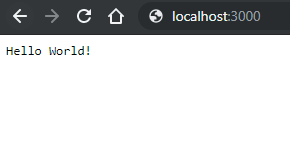

# Creare un'applicazione con nodejs ed expressjs

 :muscle: 250 pt  
 :clock130: ~ 20 min

## Prepariamo l'ambiente di lavoro

Per procedere dobbiamo avere installato

* Il nostro IDE preferito (esempio [VS Code](https://code.visualstudio.com/))
* NodeJs (scaricabile [qui](https://nodejs.org/it/))

## Node JS chi?

Node.js è un runtime Javascript, open source e multipiattaforma, orientato agli eventi per l'esecuzione di codice JavaScript, costruito sul motore JavaScript V8 di Google Chrome.\
È progettato per creare applicazioni di rete scalabili e permette di utilizzare Javascript anche per applicazioni lato server!\
Anche se nato per essere interpretato dal browser, la potenza del javascript sta nella possibilità di reagire agli eventi senza interrompere l'esecuzione del thread principale.\
Questa gestione di asincronicità permette oggi di sviluppare strumenti più veloci e non bloccanti per la creazione di applicazioni Web.

Fonte: [scopri di più su wikipedia](https://en.wikipedia.org/wiki/Node.js)

## Express! Pronti via...

In questo breve tutorial utilizzeremo il framework __Express__ per lanciare la nostra applicazione web in locale.

Tramite il *Node Packager Manager (npm)* è possibile installare librerie nella propria web app.\
*npm* è già installato se hai installato *nodejs*.\
Possiamo vedere che versione abbiamo digitando su un terminale

``` shell
npm -v
```

### 1. :bomb: Inizializzazione del progetto

Per prima cosa creiamo una cartella, per esempio nominata __myapp__, e dopo averla aperta da un terminale scriviamo

``` shell
npm init
```

Questo "magico" comdando crea il file package.json nella nostra cartella. Questo file contiene tutte le informazioni tecniche del progetto (librerie utilizzate, descrizione, autore e anche, come vederemo, script per l'esecuzione del progetto stesso).\
E' possibile personalizzare alcune configurazioni digitando la risposta ad ogni input richiesto (esempio "package name", "author", "git repository" ecc). In alternativa, digitando enter ad ogni input, il file package.json viene configurato con i parametri di default o vuoti. In ogni caso si può personalizzare il file package.json in seguito.

### 2. :handbag: Installazione express

Installiamo la prima dipendenza con il comando

``` shell
npm install express --save
```

Vedremo comparire una cartella *node_modules* al cui interno sono presenti i pacchetti scaricati tramite *npm*.
Il parametro *--save* equivale a dichiarare il modulo *express* come una dipendenza del nostro progetto.
Infatti nel package.json troveremo

``` json
"dependencies": {
  "express": "^4.17.1"
}
```

### 3. :fire: Express subito

Express è un framework web facile da usare ed è popolare proprio perché permette di partire velocemente con la creazione di una web app. [http://expressjs.com/](http://expressjs.com/)

Cominciamo con il creare un file __index.js__ come questo

``` javascript
var express = require('express');
var app = express();

app.get('/', function (req, res) {
  res.send('Hello World!');
});

app.listen(3000, function () {
  console.log('Your app listening on port 3000!');
});
```

Qui stiamo importando il modulo *express* e inizializzando la variabile *app* con la chiamata di funzione che ci dà accesso ad un set di metodi per creare il programma effettivo.

Con i metodi *get* e *send* stiamo avviando un server (http://localhost) in ascolto sulla porta 3000 che risponde con "Hello World!" sulle richieste all'URL di root (/). Per ogni altro percorso, risponderà con un errore 404.

### 4. :runner: Andiamo a vedere il risultato

Eseguiamo il nostro file con nodejs.

``` shell
node index.js
```

Apriamo quindi subito un browser e andiamo su [http://localhost:3000/](http://localhost:3000/).

Per magia troveremo la nostra pagina

]

### 5. :clap: Ok e in un progetto vero come faccio?

Iniziamo col creare un file index.html

``` html
<!DOCTYPE html>
<html lang="en">
<head>
  <meta charset="UTF-8">
  <meta name="viewport" content="width=device-width, initial-scale=1.0">
  <meta http-equiv="X-UA-Compatible" content="ie=edge">
  <title>Web App Example</title>
</head>
<body>
  Hi, I am a stupid simple web app
</body>
</html>
```

e lo inseriamo come home page modificando index.js in questo modo

``` javascript
var express = require('express');
var path = require('path');

var app = express();

app.get('/', function(req, res) {
    res.sendFile(path.join(__dirname + '/index.html'));
});

app.listen(3000, function () {
  console.log('Example app listening on http://localhost:3000/');
});
```

In questo modo la pagina punta direttamente al file *html* appena creato.
Per il routing delle singole pagine si rimanda direttamente alla [documentazione ufficiale](https://expressjs.com/it/guide/routing.html).

### 6. :rocket: Best practices

E' buona norma configurare il package.json affinché sia più facile lanciare l'applicazione.

``` json
"scripts": {
  "start": "node index.js",
  "test": "node test.js"
}
```

Possiamo ora creare un file test.js che verrà eseguito nel momento in cui lanciamo da linea di comando

``` shell
npm run test
```

Per far partire il progetto invece ci basterà il comando

``` shell
npm start
```

## Conclusione

Questo è solo un assaggio di quello che può offrire Node JS,
*npm* mette a disposizione innumerevoli librerie utili per arricchire le funzionalità del nostro progetto.\
Questa breve introduzione ha il solo scopo di familiarizzare con Node JS dimostrando come in pochi minuti è possibile tirare su un ambiente di sviluppo funzionante.
